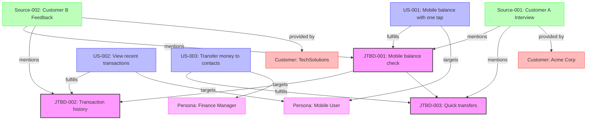

# Product Requirements Document: ProDuct Manager (PDM)

## 1. Product Overview

ProDuct Manager (PDM) is a command-line interface (CLI) tool with Model Context Protocol (MCP) integration designed to systematically capture, organize, and visualize customer feedback into actionable product insights using Jobs-to-be-Done (JTBD) framework and user stories. PDM helps product teams transform unstructured customer inputs into structured, prioritized product requirements with full traceability to source data, and can be used directly through LLM chat interfaces.

_Alternative Names:_
- **InsightForge**: Emphasizing the transformation of raw feedback into structured insights
- **RequireQL**: A query language for product requirements
- **JTBD Studio**: Focused on the JTBD methodology
- **UserGraph**: Highlighting the relationship mapping between user needs
- **ProInsight**: Professional insights for product management

## 2. Target Users

- **Product Managers**: Who need to synthesize customer feedback into requirements
- **UX Researchers**: Who collect user insights and need to organize findings
- **Product Designers**: Who need to understand user needs and prioritize features
- **Development Leads**: Who need clear, prioritized user stories with context
- **LLM Chat Users**: Who want to interact with product discovery data directly through AI assistants

## 3. User Goals and Jobs-to-be-Done

### Primary JTBD

1. "When analyzing multiple sources of customer feedback, I want to extract consistent structured insights, so I can make informed product decisions based on patterns rather than anecdotes."

2. "When building product requirements, I want to maintain traceability to original customer feedback, so I can justify priorities and validate decisions with stakeholders."

3. "When communicating user needs across teams, I want a visual representation of user stories and their relationships, so everyone understands the full context of what we're building."

4. "When working with AI assistants, I want to directly manage and update product insights, so I can streamline my workflow without context switching between tools."

## 4. Core Functional Requirements

### 4.1 Project Initialization

**As a product manager, I want to initialize a new product discovery project, so that I can organize all related customer feedback and insights in one place.**

- Create a `.pdm` directory structure for storing project configuration and data
- Configure default settings for parsing, visualization, and prioritization
- Set up metadata tracking for sources and authors
- Initialize MCP server configuration for LLM chat integration

### 4.2 Source Parsing

**As a user researcher, I want to parse multiple feedback sources into structured JTBDs and user scenarios, so that I can transform unstructured data into actionable insights.**

- Support multiple input formats (text files, markdown, folders of files)
- Extract JTBDs in "When [situation], I want to [motivation], so I can [expected outcome]" format
- Extract user stories in "As a [persona], I want to [action], so that I can [value/goal]" format
- Maintain source attribution including file path, customer name, and date
- Assign preliminary priority based on source content analysis
- Support recursive directory parsing for bulk processing
- Enable direct parsing requests through LLM chat interfaces

### 4.3 Tree Consolidation and Graph Structure

**As a product manager, I want to combine insights from multiple sources without duplication, so that I can see the complete picture of user needs across all feedback channels.**

- Identify similar JTBDs and user stories using semantic matching
- Consolidate without losing source attribution
- Calculate priority scores based on mention frequency, customer segment, and recency
- Build relationships between JTBDs and corresponding user stories
- Maintain hierarchical structure between parent and child JTBDs
- Generate a unified tree with comprehensive metadata
- Support consolidation operations through LLM chat commands

#### 4.3.1 Graph Structure for Consolidation

The system uses a directed property graph structure to represent the relationships between entities:

- **Nodes**:
  - JTBD Nodes (with attributes for statement, priority, etc.)
  - User Story Nodes (with attributes for persona, action, value)
  - Source Nodes (representing customer feedback files)
  - Customer Nodes (representing individual customers)
  - Persona Nodes (representing user types)

- **Edge Types**:
  - `FULFILLS`: User Story → JTBD (indicates a story that fulfills a job)
  - `MENTIONS`: Source → JTBD/User Story (shows which source mentioned a job/story)
  - `PROVIDED_BY`: Source → Customer (tracks which customer provided which feedback)
  - `PARENT_OF`: JTBD → JTBD (hierarchical relationship between jobs)
  - `SIMILAR_TO`: JTBD → JTBD or User Story → User Story (weighted similarity relationship)
  - `TARGETS`: User Story → Persona (which persona a user story is for)
  - `CONSOLIDATED_FROM`: Consolidated JTBD → Source JTBDs (tracks consolidation sources)

- **Edge Properties**:
  - `weight`: Strength of relationship (0.0-1.0)
  - `confidence`: Confidence in the relationship (0.0-1.0)
  - `contribution`: How much a source JTBD contributes to a consolidated JTBD

#### 4.3.2 Consolidation Algorithm

1. **Semantic Similarity Calculation**:
   - Use embedding models to vectorize JTBDs and user stories
   - Calculate cosine similarity between all pairs
   - Create `SIMILAR_TO` edges with similarity scores above threshold

2. **Entity Resolution**:
   - Build a similarity graph of all JTBDs
   - Apply community detection algorithms to identify clusters
   - For each cluster, generate a consolidated JTBD representation

3. **User Scenario Consolidation**:
   - Group user scenarios by:
     - Similar target personas
     - Similar actions being performed
     - Similar value/goals
     - Semantic similarity of overall statements
   - Consolidate similar scenarios while preserving unique attributes
   - Create a canonical user scenario for each cluster
   - Maintain traceability to source scenarios via `DERIVED_FROM` edges
   - Preserve persona-specific variations where relevant

4. **Relationship Preservation**:
   - Transfer all source relationships to consolidated nodes
   - Adjust priorities based on cluster size and source priorities
   - Preserve provenance through `CONSOLIDATED_FROM` edges

5. **Hierarchical Structure Generation**:
   - Detect parent-child relationships through:
     - Explicit references ("Parent job: X")
     - Semantic subsumption (job A contains all aspects of job B)
     - Granularity analysis (specific vs. general jobs)
   - Create `PARENT_OF` relationships in the graph

6. **User Story to JTBD Mapping**:
   - Match each consolidated user story to its most relevant consolidated JTBD(s)
   - Create `FULFILLS` edges with confidence scores
   - Allow a single user story to fulfill multiple JTBDs with different weights
   - Ensure that consolidated relationships maintain the semantic intent of original relationships

7. **Cross-Validation**:
   - Validate consolidated JTBDs against their mapped user scenarios
   - Identify potential gaps or inconsistencies
   - Suggest additional user scenarios for JTBDs with insufficient coverage
   - Highlight orphaned user scenarios not clearly mapped to any JTBD

#### 4.3.3 Query Capabilities

The graph structure enables powerful query capabilities:

- Find all JTBDs mentioned by Customer X
- Find all user stories that fulfill JTBD Y
- Identify orphaned JTBDs with no fulfilling user stories
- Trace a user story back to all its source feedback
- Find the most frequently mentioned JTBDs across all sources
- Identify clusters of related JTBDs and user stories

### 4.4 Visualization Generation

**As a product stakeholder, I want to visualize JTBD and user scenario relationships, so that I can better understand and communicate complex user needs.**

- Generate visualizations in draw.io XML format for editing
- Support multiple views:
  - JTBD-centric view (JTBDs with connected user stories)
  - Persona-centric view (personas with their user stories)
  - Priority heat map (visual priority representation)
  - Source attribution view (showing which customers mentioned which needs)
- Use color coding to represent priority levels
- Include key metadata in node labels
- Support export to PNG/SVG for sharing in documents
- Enable visualization requests through LLM chat interfaces

### 4.5 Insight Browsing

**As a product team member, I want to browse and filter all extracted insights with their metadata, so that I can focus on specific aspects of user needs.**

- List all JTBDs and user scenarios in tabular format
- Include comprehensive metadata (priority, source, date, etc.)
- Support filtering by content, source, priority, and other attributes
- Allow sorting by various criteria (priority, date, source)
- Support multiple output formats (table, JSON)
- Provide browsing capabilities through LLM chat commands

### 4.6 JTBD and Scenario Management

**As a product manager, I want to update JTBDs and user scenarios directly, so that I can refine insights as my understanding evolves.**

- Edit existing JTBDs with full source traceability preservation
- Update user scenarios while maintaining relationships
- Adjust priority ratings based on new information
- Modify relationships between JTBDs and scenarios
- Enable bulk updates to related items
- Provide natural language editing capabilities through LLM chat interfaces

### 4.7 MCP Integration

**As an LLM chat user, I want to interact with PDM directly through chat interfaces, so that I can manage product insights without switching contexts.**

- Implement MCP server to expose PDM functionality to LLM chat interfaces
- Support natural language commands for all core operations
- Enable direct JTBD and user scenario updates through simple commands
- Provide conversational feedback on operations
- Maintain context and state between interactions
- Support multi-turn operations for complex tasks
- Enable sharing of visualizations directly in chat

### 4.8 Data Lifecycle Management

**As a product manager, I want to manage the full lifecycle of JTBDs and user scenarios, so that I can maintain a clean and relevant set of product insights over time.**

- Archive obsolete JTBDs and scenarios while preserving historical data
- Soft-delete items with options for restoration within a configurable time period (default: 30 days)
- Hard-delete sensitive or erroneous data with proper authorization
- Maintain complete audit trails of all deletion and archiving actions
- Automatically detect and suggest candidates for archiving based on age and relevance
- Preserve relationships even for archived items to maintain historical context
- Support bulk archiving/deletion operations with confirmation safeguards
- Enable filtering to include/exclude archived items in queries and visualizations
- Implement automated cleanup policies with configurable retention periods
- Provide MCP commands for lifecycle management operations:
  ```
  pdm archive <id>              # Archive a JTBD or user scenario
  pdm restore <id>              # Restore an archived item
  pdm delete <id> [--permanent] # Soft-delete or permanently delete an item
  pdm cleanup [--age=<days>]    # Run automated cleanup based on age
  ```

### 4.9 Error Handling and Reporting

**As a system user, I want comprehensive error handling and reporting, so that I can quickly identify and resolve issues without losing data or context.**

- Implement multi-level error severity classification (warning, error, critical)
- Provide context-specific error messages with actionable resolution steps
- Handle specific error scenarios with appropriate responses:
  - API timeouts: Implement retry mechanisms with exponential backoff
  - Parsing failures: Identify specific problematic content and suggest corrections
  - Graph inconsistencies: Provide repair options and visualization of the issue
  - Synchronization conflicts: Show diff between JSON and graph representations
  - Input validation failures: Highlight specific validation rules that failed
- Log all errors with detailed context for troubleshooting
- Generate error reports in user-friendly formats
- Implement graceful degradation for non-critical component failures
- Provide MCP-specific error handling with conversational error resolution:
  ```
  User: "pdm update jtbd-001 with an invalid format"
  PDM: "I noticed an issue with that update. The JTBD format should follow 
        'When [situation], I want to [motivation], so I can [expected outcome]'.
        Would you like me to help reformulate your update?"
  ```
- Create error recovery workflows for common failure scenarios
- Enable telemetry for error patterns (opt-in, privacy-preserving)

### 4.10 Data Validation

**As a system user, I want robust data validation, so that I can trust the integrity and quality of my product insights.**

- Implement schema validation for all data structures (JTBDs, user stories, sources)
- Enforce structural validation for:
  - JTBD format: "When [situation], I want to [motivation], so I can [expected outcome]"
  - User story format: "As a [persona], I want to [action], so that I can [value/goal]"
  - Relationship integrity: No dangling references or circular dependencies
- Validate semantic coherence:
  - Detect and flag inconsistencies between related JTBDs and user stories
  - Identify conflicting priority assignments across related items
  - Check for semantic drift when updating consolidated items
- Implement data quality scoring:
  - Completeness: All required fields and relationships present
  - Consistency: No contradictions across related items
  - Specificity: Content is sufficiently detailed and concrete
- Provide validation reports with improvement suggestions
- Enable batch validation of entire projects with comprehensive reporting
- Implement pre-commit validation hooks for all update operations
- Offer interactive validation assistance through MCP:
  ```
  User: "pdm validate project"
  PDM: "I found 3 JTBDs missing clear outcome statements and 2 user stories 
        without defined personas. Would you like me to help fix these issues?"
  ```
- Support customizable validation rules based on project-specific requirements
- Implement progressive validation that can adapt to different levels of project maturity

### 4.11 Iterative Discovery Process

**As a product manager, I want to continuously incorporate new feedback sources into my existing analysis, so that my product insights evolve as I gather more customer data.**

- Support incremental addition of new sources to existing projects
- Enable selective parsing of new sources without affecting existing data
- Implement intelligent re-consolidation that preserves previous manual edits
- Provide clear versioning of consolidated trees to track evolution over time
- Support comparison between consolidation iterations to identify new insights
- Enable rollback to previous consolidation versions if needed
- Maintain all source relationships across multiple iterations
- Track iteration history with metadata (date, source count, major changes)
- Highlight newly identified JTBDs and user scenarios from recent additions
- Implement specific MCP commands for iterative workflows:
  ```
  pdm add-sources <sources...>         # Add new sources to existing project
  pdm consolidate --new-only           # Consolidate only newly added sources
  pdm consolidate --incremental        # Incrementally update existing consolidation
  pdm diff-iterations <v1> <v2>        # Compare results between iterations
  pdm rollback --iteration=<n>         # Rollback to a previous iteration
  pdm history                          # Show iteration history
  ```

#### 4.11.1 Incremental Consolidation Algorithm

The incremental consolidation process preserves work from previous iterations while incorporating new insights:

1. **Source Tagging**:
   - Tag all newly added sources with the current iteration number
   - Maintain a history of when each source was added

2. **Differential Extraction**:
   - Extract JTBDs and user scenarios from only the new sources
   - Compare with existing items to identify truly new concepts

3. **Smart Merging**:
   - Identify existing consolidated items that new items might belong to
   - Propose mergers with confidence scores
   - Allow for manual approval of suggested merges via MCP

4. **Priority Recalculation**:
   - Recalculate priorities based on the expanded source base
   - Highlight significant priority shifts between iterations
   - Preserve manually assigned priorities unless explicitly overridden

5. **Relationship Preservation**:
   - Maintain all manually created relationships
   - Add new relationships based on the latest consolidation
   - Detect and highlight potential conflicts in relationships

6. **Iteration Versioning**:
   - Create a snapshot of the consolidated state after each iteration
   - Enable comparison between iterations
   - Support selective rollback of specific changes

## 5. Technical Requirements

### 5.1 Command-line Interface

```
pdm init [--name=<project-name>] [--dir=<directory>]
pdm parse <source> [--format=<md|txt|json>] [--recursive] [--output=<output-file>]
pdm combine [sources...] [--output=<output-file>] [--algorithm=<simple|semantic>]
pdm visualize [tree-file] [--format=<drawio|png|svg>] [--view=<jtbd|persona|priority|source>]
pdm list [--filter=<query>] [--sort=<priority|date|source>] [--format=<table|json>]
pdm update <id> [--type=<jtbd|scenario>] [--statement=<text>] [--priority=<1-10>] [--sources=<ids>]
```

### 5.2 MCP Command Interface

```
pdm init                                 # Initialize a new PDM project
pdm parse <source>                       # Parse source into JTBDs and scenarios
pdm combine <sources...>                 # Consolidate multiple sources
pdm visualize [tree] [view-type]         # Generate visualization 
pdm list [filter]                        # List JTBDs and scenarios
pdm update <id> <updated-content>        # Update JTBD or scenario
pdm get <id>                             # Get details of specific JTBD or scenario
pdm relate <id1> <id2>                   # Create relationship between items
```

### 5.3 AI Integration

- Claude 3.7 Sonnet for natural language parsing and semantic analysis
- Configurable model parameters (temperature, max tokens)
- Model Context Protocol server for LLM chat integration
- Conversational state management for multi-turn interactions

### 5.4 Data Structure and Graph Implementation

Hybrid approach combining JSON storage with Neo4j embedded for graph operations:

1. **Primary Data Storage in JSON**:
   - Store all entities (JTBDs, scenarios, sources) in structured JSON files
   - Use a predictable file organization within the `.pdm` directory
   - Enable easy version control and sharing of data files
   - Support direct JSON editing for advanced users
   - Maintain human-readable format for better transparency
   - Include automatic backups of JSON data

2. **Neo4j Embedded for Graph Analysis**:
   - Use Neo4j embedded as an in-memory graph engine
   - Load graph representation dynamically from JSON sources when needed
   - Perform complex relationship queries and analysis through Cypher
   - Generate visualizations using Neo4j's graph capabilities
   - Cache graph structures for improved performance
   - Write analysis results back to JSON when appropriate

3. **Synchronization Layer**:
   - Implement automatic synchronization between JSON and graph representations
   - Track modification timestamps to maintain consistency
   - Use transaction-like operations to ensure data integrity
   - Handle graph reconstruction if JSON is modified externally
   - Provide hooks for custom synchronization logic

4. **NPM Packaging for MCP**:
   - Distribute as a single NPM package (pdm-ai) installable via NPX
   - Include Neo4j embedded JVM and necessary libraries
   - Auto-configure memory limits based on available system resources
   - Expose MCP server interface identical to task-master-ai pattern
   - Configure via environment variables in the MCP config
   - Example configuration:
   ```json
   {
     "mcpServers": {
       "pdm-ai": {
         "command": "npx",
         "args": ["-y", "--package=pdm-ai", "pdm-ai"],
         "env": {
           "ANTHROPIC_API_KEY": "${ANTHROPIC_API_KEY}",
           "MODEL": "claude-3-7-sonnet-20250219",
           "NEO4J_EMBEDDED_MEMORY": "1G",
           "NEO4J_EMBEDDED_CACHE_SIZE": "50M",
           "PDM_DATA_DIR": "${HOME}/.pdm/data",
           "JSON_BACKUP_INTERVAL": "5m"
         }
       }
     }
   }
   ```

5. **Technical Implementation Details**:
   - Use node-java bridge to interact with Neo4j's Java APIs
   - Implement a graph service layer for common operations
   - Lazy-load graph data only when needed for analysis
   - Provide graceful shutdown to ensure data persistence
   - Include automatic index creation for optimal performance
   - Implement connection pooling for concurrent MCP requests

6. **Fallback and Recovery**:
   - Auto-detect JVM availability and fall back to a pure JavaScript graph implementation if needed
   - Support reconstruction of graph from JSON if graph database becomes corrupted
   - Enable automatic recovery from inconsistent states
   - Maintain audit trail of all operations for debugging

The preferred implementation is this **Hybrid JSON/Neo4j** approach. This solution offers excellent portability through JSON storage while leveraging Neo4j's powerful graph capabilities for complex relationship analysis. Users benefit from the simplicity of JSON for data interchange while gaining the analytical power of a proper graph database.

## 6. Non-Functional Requirements

### 6.1 Performance

- Process files up to 10MB in size
- Support projects with up to 1000 individual JTBDs and scenarios
- Complete parsing operations within 2 minutes per file (dependent on API responsiveness)
- Respond to MCP requests within 3 seconds

### 6.2 Security

- Store API keys securely in environment variables
- No transmission of customer data beyond necessary API calls
- Local storage of all parsed data
- Secure MCP server communications

### 6.3 Usability

- Clear, consistent command syntax
- Helpful error messages
- Progress indicators for long-running operations
- Documentation for all commands and options
- Natural language command processing for LLM chat interfaces
- Conversational feedback for operations

## 7. Development Phases

### Phase 1: Core Functionality

- Project initialization
- Basic parsing of text files
- Simple JTBD and user story extraction
- Command-line interface implementation
- Basic visualization in draw.io format

### Phase 2: Enhanced Analysis

- Semantic consolidation of similar items
- Multi-source parsing
- Priority calculation algorithms
- Enhanced visualization options
- Filtering and sorting functionality
- MCP server implementation for LLM chat integration

### Phase 3: Advanced Features

- Research-backed prioritization
- Multiple visualization views
- Batch processing capabilities
- Export to additional formats
- Integration with other product management tools
- Advanced conversational interfaces for LLM chat
- Complex multi-turn operations through MCP

## 8. Dependencies

- Node.js runtime environment
- Claude API integration
- draw.io compatibility for visualizations
- MCP server infrastructure for LLM chat integration

## 9. Success Metrics

- Reduction in time spent organizing customer feedback (target: 50% reduction)
- Increase in traceable requirements (target: 90% of requirements traceable to source)
- Improvement in stakeholder understanding of user needs (qualitative assessment)
- Reduction in requirements churn during development (target: 30% reduction)
- Usage frequency through LLM chat interfaces (target: 40% of all interactions)
- User satisfaction with conversational interface (target: 85% satisfaction rating)

## 10. Appendix

### Example JSON Structure

```json
{
  "project": "Mobile Banking App",
  "generated": "2025-04-26T14:30:00Z",
  "sources": [
    {
      "id": "source-001",
      "name": "Customer A Feedback",
      "type": "interview",
      "date": "2025-04-20",
      "path": "/userinput/customerA/interview.txt"
    }
  ],
  "jtbds": [
    {
      "id": "jtbd-001",
      "statement": "When I'm away from my computer, I want to quickly check my account balance, so I can make informed spending decisions",
      "priority": 9,
      "sources": ["source-001", "source-003"],
      "sourceQuotes": [
        {
          "source": "source-001",
          "text": "I need to be able to check my balance when I'm out shopping"
        }
      ],
      "relatedScenarios": ["scenario-001", "scenario-005"],
      "editHistory": [
        {
          "date": "2025-04-26T14:30:00Z",
          "user": "john.doe@example.com",
          "previousVersion": "When out shopping, I want to check my balance, so I can make spending decisions",
          "source": "CLI"
        }
      ]
    }
  ],
  "scenarios": [
    {
      "id": "scenario-001",
      "format": "user-story",
      "statement": "As a mobile user, I want to see my account balance with one tap, so that I can quickly check funds before making a purchase",
      "persona": "Mobile User",
      "action": "see my account balance with one tap",
      "value": "quickly check funds before making a purchase",
      "priority": 8,
      "sources": ["source-001"],
      "relatedJtbds": ["jtbd-001"],
      "editHistory": [
        {
          "date": "2025-04-26T15:45:00Z",
          "user": "AI Assistant",
          "previousVersion": "As a user, I want to see my balance quickly, so I can check funds before purchasing",
          "source": "MCP"
        }
      ]
    }
  ]
}
```

### Example Visualization Output

The tool will generate draw.io compatible XML files that create visualizations like:

- JTBD hierarchy trees with priority indicators
- User story to JTBD mapping diagrams
- Source attribution maps showing which customers contributed to which insights
- Priority heat maps for feature planning

### Consolidated Graph Example



### Example MCP Interaction Patterns

```
User: "I need to update JTBD-001 to better reflect our mobile users' needs."
PDM: "I'd be happy to help update JTBD-001. Here's the current statement:
      'When I'm away from my computer, I want to quickly check my account balance, so I can make informed spending decisions'
      What would you like to change about it?"

User: "pdm update jtbd-001. When using my mobile app, I want to see my account balance with a single tap, so I can quickly make informed spending decisions while shopping."
PDM: "I've updated JTBD-001 to:
      'When using my mobile app, I want to see my account balance with a single tap, so I can quickly make informed spending decisions while shopping.'
      The update has been saved with full source traceability. Would you like me to update the related user scenarios as well?"

User: "Yes, please update scenario-001 to match the new JTBD."
PDM: "I've updated scenario-001 to:
      'As a mobile app user, I want to see my account balance with a single tap, so that I can quickly check funds before making a purchase in-store.'
      The relationship to JTBD-001 has been maintained. Would you like to see a visualization of the updated relationship?"
````